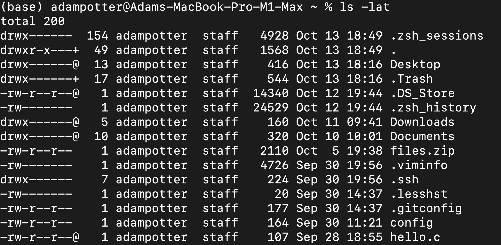
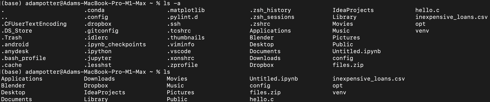
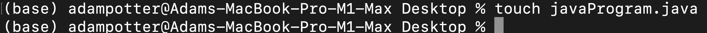

#  Week 1 - Access and the Filesystem

In this project we discuss how to download and setup VS code, remotely connect to ieng6 using ssh, run various commands, copying files over ssh, and generating ssh keys.

---
## How to install Visual Studio Code

### Step One 

- Go to [VS code download](https://code.visualstudio.com/) and click "Download Mac Universal"  
- Then go through all the prompts and finish installing the IDE.
- Open it once the installation is complete and look for a tab at the top that says Terminal then click open new terminal. 
- The terminal is where you will type all your git commands and ssh commands.

---

## How to remotely connect 

### Step Two

- Open up Visual Studio Code and then open up a new terminal.
- Type "ssh cs15lfa22ii@ieng6.ucsd.edu" for me it is ii for you it will be something different. 
- You will be prompted to type in your password, type it in.

- Now you are logged into the ieng6 remote server, where your code will be executed and your files will be stored. 

---

## Trying Some Commands
### Step Three
  - **ls -lat** gives us more info on files such as last modified date and time.
  - **ls -a** shows all files plus the hidden ones.
  - **touch fileName.fileExtension** creates an empty file in the current directory with the extension given.
  
  
  

---

## How to moving files with scp
### Step Four
- Next on your remote computer you will want to open the terminal and type scp fileName.extensionType severAddress:Directory
- This will copy the file from your remote machine to the server.
- When done you can remote SSH into the server to check to see if the file is in the directory you sent it to.

---

## How to set up an SSH key
### Step Five 
- SSH keys allow for us to automatically login. This allows us to not have to type/remember our password every time we want to login.
- First, we need to generate an SSH key using the RSA encryption algorithm. To do this we run the command ssh-keygen.
- Second, we copy our ssh public key over to the server by using the command scp /Users/adampotter/.ssh/id_rsa.pub a1potter@ieng6.ucsd.edu:~/authorized_keys. This will copy our public key from our local machine to the remote server.

---

## How to optimizing remote running
### Step Six
- First, cd .ssh 
- Second, vim config
- Third, type Host NameYouWantToUse
- Fourth, type HostName followed by the host address
- Fifth, type User YourUserName

---

### **Back to main page**
  - [**Main page**](https://adamt603.github.io/cse15l-lab-reports/)

