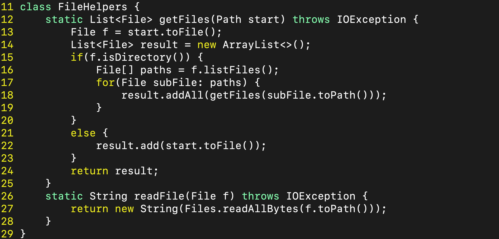
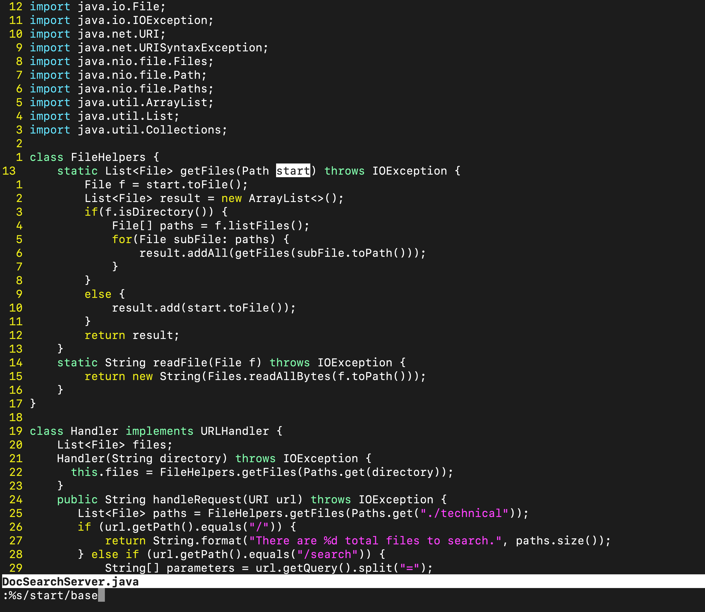
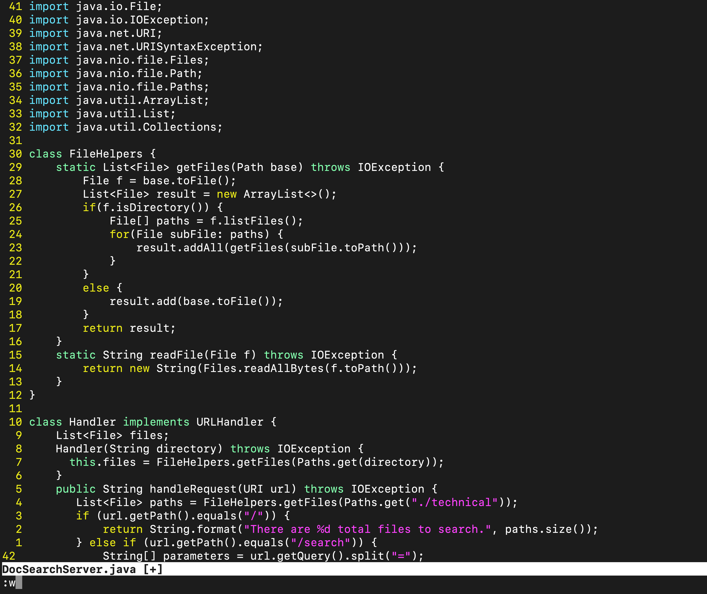

# Week 7 Part 1: Using vim

---

## In DocSearchServer.java, change the name of the start parameter of getFiles, and all of its uses, to instead be called base.

### Explaining %s
```:[range]s/{pattern}/{string}/[flags] [count]```
- [range] is the # of lines we want to evaluate 
- [count] is the # of occurrences of {pattern} we want to change to {string}
- [flags] modify the command like g changes all occurrences for all lines while % changes all occurrences for the whole file.

## Explaining :w
- :w is used to save your changes to the file as vim creates a copy and the file is left unchanged till saved.
- :x is even cooler in my opinion as it saves and quits. But some might use :wq for that.

**In short this %s command finds all "pattern" and changes them to "string" kind of like find and change all.**


```vim DocSearchServer.java```
- opens DocSearchServer.java in vim

- This is what the DocSearch file looks like before the command is ran 


- Then what you do is type each key %+s+/+s+t+a+r+t+/+b+a+s+e and then right after press enter 

```:%s/start/base<Enter>:w```
- Find each occurrence of 'base' (in all lines), and replace it with 'start'.
- 
- This image shows the changes after executing the command.


- Then after executing the pervious command save the changes by typing : + w this will save the changes to the file.

--- 

# Week 7 Part 2: bash

VSCODE time
- 2 minutes
vim time
- 27 seconds

## Which of these two styles would you prefer using if you had to work on a program that you were running remotely, and why?

- If a small change needed to be done vim makes more sense. But if I'm programming something massive I prefer VScode especially when working remotely, because if the schools internet has anything to say about it then I'm not coding most of my time is spent trying to reconnect to that remote server. 

## What about the project or task might factor into your decision one way or another? (If nothing would affect your decision, say so and why!)
- Another thing that would factor into my decision would be if I needed a more powerful PC to run my code or even a different operating system. For example, In CSE30 we need a 32-bit machine and my personal computer is 64-bits.
