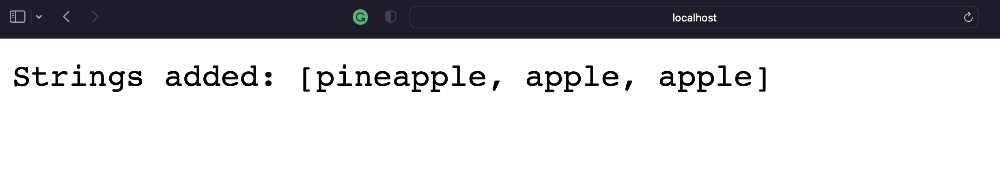

#  Week 2 - Building a website 

In this lab we built a website with methods that were called on by path inputs that manipulate the backend.

---

## Which methods in your code are called?

### Methods
- **SearchEngine** method is first called to check if a port number was given and if so call handleRequest.
- **handleRequest** method is called which handles the addition of strings and searching of them.

---

## What the values of the relevant arguments to those methods are, and the values of any relevant fields of the class?

### relevant values and arugments 
- **listOfStrings** is a relevant value and it stores all strings given by the user in the path.
- **mates** is a relevant value and it stores all the strings that match the desired string by the user.

---

## If those values change, how they change by the time the request is done processing?

### changing values
- **listOfStrings** changes when ever the user requests to add a new value.
- **mates** changes temporarily to store the values that matches the user input.

---





```
import java.util.*;
import java.io.IOException;
import java.net.URI;

class Handler implements URLHandler{
    // The one bit of state on the server: a number that will be manipulated by
    // various requests.
    int num = 0;
    ArrayList<String> listOfStrings = new ArrayList<String>();

    public String handleRequest(URI url) {
        if (url.getPath().equals("/")) {
            return String.format("Number: %d", num);
        } 
        else if (url.getPath().equals("/increment")) {
            num += 1;
            return String.format("Number incremented!");
        } 
        // else if (url.getPath().equals("/search")) {
        //     System.out.println("Path: " + url.getPath());
        //     if (url.getPath().contains("/search")) {
        //         String[] parameters = url.getQuery().split("=");
        //         if (parameters[0].equals("s")) {
        //             StringBuilder eb = new StringBuilder();
        //             for (String e: listOfStrings){
        //                 eb.append(e);
        //                 eb.append(",\t");
        //             }
        //             return String.format("Strings added: %s", eb.toString());
        //         }
        //     }
        //     return "404 Not Found!";
        // }
        else {
            System.out.println("Path: " + url.getPath());
            if (url.getPath().contains("/add")) {
                String[] parameters = url.getQuery().split("=");
                if (parameters[0].equals("s")) {
                    listOfStrings.add(parameters[1]);
                    return String.format("String added is %s", listOfStrings.get(num++));
                }
            }
            else if (url.getPath().contains("/search")) {
                ArrayList<String> matches = new ArrayList<String>();
                String[] parameters = url.getQuery().split("=");
                if (parameters[0].equals("s")) {
                    int index1 = listOfStrings.indexOf(parameters[1]);
                    for (String all: listOfStrings){
                        if (all.contains(parameters[1])){
                            matches.add(all);
                        }
                    }
                    String k[] = matches.toArray(new String[matches.size()]);
                    String str = Arrays.toString(k);
                    return String.format("Strings added: %s", str);
                }
                return "404 Not Found!";
            }
        return "404 Not Found!";
```


#  Week 3 - Bug fixing

## Bug #1

### The failure-inducing input (the code of the test)
```@Test
public void testReverse(){
  int[] input2 = {1, 2, 3, 4, 5, 6, 7};
  int[] whatWeWant = {7, 6, 5, 4, 3, 2, 1};
  ArrayExamples.reverseInPlace(input2);
  assertArrayEquals(whatWeWant, input2);
}
```
---
### The symptom (the failing test output)
- It returned an arrary with all element values equal to zero
---
### The bug (the code fix needed)
- The code should have been someNewArray[i] = arr[arr.length - i -1].
---
### Then, explain the connection between the symptom and the bug. Why does the bug cause that particular symptom for that particular input?
- The bug causes this to happen because instead of assigning the values from the old array to some new array we overwrite the old one with the new one that has zeros for values.
---

## Bug #2

### The failure-inducing input (the code of the test)

---
### The symptom (the failing test output)
```
@Test 
  public void averageWithoutLowestTest(){
    double[] input4 = {5, 5, 5, 4, 1};
    assertEquals(3.0, ArrayExamples.averageWithoutLowest(input4), 0);
  }
  ```
---
### The bug (the code fix needed)
- We should have a temp value that stores the lowest and checks it with other values so it only removes one value and not the rest.
---
### Then, explain the connection between the symptom and the bug. Why does the bug cause that particular symptom for that particular input?
- The connection is that we are constantly throwing out the "lowest value" so if we have multiple of the same we run into issues.

