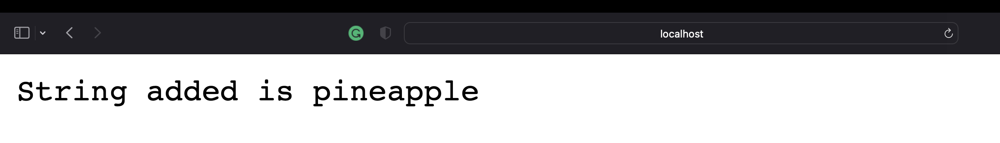
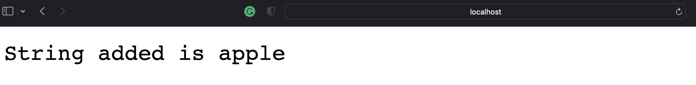
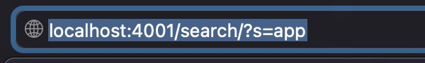

#  Week 2 - Building a website 

In this lab we built a website with methods that were called on by path inputs that manipulate the backend.

---

## Which methods in your code are called?

### Methods
- **SearchEngine** method is first called to check if a port number was given and if so call handleRequest.
- **handleRequest** method is called which handles the addition of strings and searching of them.

---

## What the values of the relevant arguments to those methods are, and the values of any relevant fields of the class?

### relevant values and arugments 
- **listOfStrings** is a relevant value and it stores all strings given by the user in the path.
- **mates** is a relevant value and it stores all the strings that match the desired string by the user.

---

## If those values change, how they change by the time the request is done processing?

### changing values
- **listOfStrings** changes when ever the user requests to add a new value.
- **matches** changes temporarily to store the values that matches the user input.

---


- In the image above matches receives the String value ```"anewstringtoadd"``` then stores the value in listOfStrings. 
  

- In the image above we can see the url and the query that got us our output.
  

- In the image above matches receives the String value ```"pineapple"``` then stores the value in listOfStrings. 
  

- In the image above we can see the url and the query that got us our output.
  

- In the image above matches receives the String value ```"apple"``` then stores the value in listOfStrings. 
  

- In the image above we can see the url and the query that got us our output.

- In the above image we can see all of the inputs output that we searched for.

- In the above image we can see the string we searched for in our array which was ```"app"```

```
import java.util.*;
import java.io.IOException;
import java.net.URI;

class Handler implements URLHandler{
    // The one bit of state on the server: a number that will be manipulated by
    // various requests.
    int num = 0;
    ArrayList<String> listOfStrings = new ArrayList<String>();

    public String handleRequest(URI url) {
        if (url.getPath().equals("/")) {
            return String.format("Number: %d", num);
        } 
        else if (url.getPath().equals("/increment")) {
            num += 1;
            return String.format("Number incremented!");
        } 
        // else if (url.getPath().equals("/search")) {
        //     System.out.println("Path: " + url.getPath());
        //     if (url.getPath().contains("/search")) {
        //         String[] parameters = url.getQuery().split("=");
        //         if (parameters[0].equals("s")) {
        //             StringBuilder eb = new StringBuilder();
        //             for (String e: listOfStrings){
        //                 eb.append(e);
        //                 eb.append(",\t");
        //             }
        //             return String.format("Strings added: %s", eb.toString());
        //         }
        //     }
        //     return "404 Not Found!";
        // }
        else {
            System.out.println("Path: " + url.getPath());
            if (url.getPath().contains("/add")) {
                String[] parameters = url.getQuery().split("=");
                if (parameters[0].equals("s")) {
                    listOfStrings.add(parameters[1]);
                    return String.format("String added is %s", listOfStrings.get(num++));
                }
            }
            else if (url.getPath().contains("/search")) {
                ArrayList<String> matches = new ArrayList<String>();
                String[] parameters = url.getQuery().split("=");
                if (parameters[0].equals("s")) {
                    int index1 = listOfStrings.indexOf(parameters[1]);
                    for (String all: listOfStrings){
                        if (all.contains(parameters[1])){
                            matches.add(all);
                        }
                    }
                    String k[] = matches.toArray(new String[matches.size()]);
                    String str = Arrays.toString(k);
                    return String.format("Strings added: %s", str);
                }
                return "404 Not Found!";
            }
        return "404 Not Found!";
```


#  Week 3 - Bug fixing

## Bug #1

### The failure-inducing input (the code of the test)
```@Test
public void testReverse(){
  int[] input2 = {1, 2, 3, 4, 5, 6, 7};
  int[] whatWeWant = {7, 6, 5, 4, 3, 2, 1};
  ArrayExamples.reverseInPlace(input2);
  assertArrayEquals(whatWeWant, input2);
}
```
---
### The symptom (the failing test output)

- The symptom was that we wanted 3 at position 4 in the array but we got five. This was because we over wrote the first half of the array with the second half thus losing the starting values in the array. 
---
### The bug (the code fix needed)
- This can easily be fixed by making a temp array and cloning the arr array into it. Then using the temp array to swap the values into the arr array.
  ```
    static void reverseInPlace(int[] arr) {
    int[] tempArray = arr.clone();
    for(int i = 0; i < arr.length; i += 1) {
      arr[i] = tempArray[arr.length - i - 1];
    }
  }
  ```

---
### Then, explain the connection between the symptom and the bug. Why does the bug cause that particular symptom for that particular input?
- The reason the bug causes this particular symptom is it takes an array and starts copying the furthest values to the front overwriting the front values so they are lost forever. So when we go to retrieve the value from position 4 we get five instead of 3 because thats what was written there.
---

## Bug #2

### The failure-inducing input (the code of the test)
- The failure was that we should have gotten back ```["bob", "bbb","   b"]``` but we got back ```["    b", "bbb", "bob"]```
```
@Test
    public void filterTest(){
      List<String> list = new ArrayList();
        list.add("bob");
        list.add("apple");
        list.add("");
        list.add("bbb");
        list.add("    b");
        list = ListExamples.filter(list, new filters());
        System.out.println(list.toString());
        assertArrayEquals(["bob", "bbb","   b"], filter(list, new filters()).toString());
        
    }
```
---
### The symptom (the failing test output)

---
### The bug (the code fix needed)
- There was so much wrong with this code. First, StringChecker was an interface meaning we needed a class to implement it. 
```
class filters implements StringChecker{
  public boolean checkString(String s){
    return s.contains("b");
  }
}
```
- As you can see above I implemented the class and used the contains method to return true or false if the string contained the character. 

- Futhermore, to return the correct order all we need to do is use ```Collections.reverse()``` method before returning our List  
  
  ```
  class ListExamples {

  // Returns a new list that has all the elements of the input list for which
  // the StringChecker returns true, and not the elements that return false, in
  // the same order they appeared in the input list;
  static List<String> filter(List<String> list, StringChecker sc) {
    List<String> result = new ArrayList<>();
    for(String s: list) {
      if(sc.checkString(s)) {
        result.add(0, s);
      }
    }
    return  Collections.reverse(result);
  }
  ```
---
### Then, explain the connection between the symptom and the bug. Why does the bug cause that particular symptom for that particular input?
- One of the major symptoms is, we don't even have a class for StringChecker. Meaning you can't make an instance of it because its an interface. Thus leading to un-working code period. But once you fix that we are left with a backwards out put that needs fixing using a reverse method. There are many ways at which you could fix the bug of the list being saved backwards but that is one of them. 

