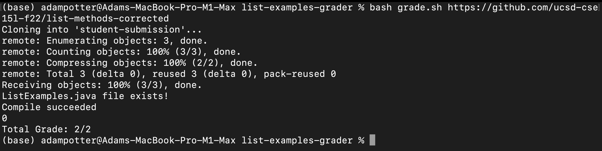
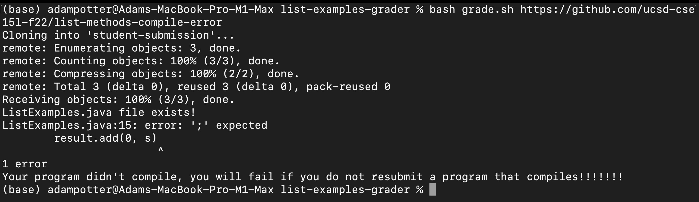
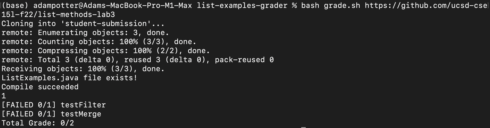

# Lab Report 5: grading student submissions using bash

## grade.sh code block 
``` 
#variables 
FILE="./student-submission/ListExamples.java"
FILENAME=ListExamples.java
CLASSPATH=".:../lib/hamcrest-core-1.3.jar:../lib/junit-4.13.2.jar"
POINTSFORASSIGNMENT=2

# Create your grading script here

#stops execution after one failer 
#set -e
# deletes the directory recusrively ./student-submission
rm -rf student-submission
# clones the students submission from a terminal input url and stores it in the directory ./student-submission
git clone $1 student-submission
cp TestListExamples.java student-submission

if [[ -e $FILE ]]
then
    echo $FILENAME "file exists!"
else
    echo $FILENAME "file not found!"
    exit 1
fi

#advances the directory to student-submssion directory
cd student-submission

#compiles all java files into .class byte code files and is also given the class path for junit 
javac -cp $CLASSPATH *.java 

#check if there was compilation errors
if [[ $? -eq 0 ]]
then
    echo "Compile succeeded"
else
    echo "Your program didn't compile, you will fail if you do not resubmit a program that compiles!!!!!!!"
    exit 2
#Ends logical selection 
fi

#Executes the TestListExamples junit program to determine if the students code is working
java -cp $CLASSPATH org.junit.runner.JUnitCore TestListExamples > errors.txt

#Uses grep -c to check the number of instances testFilter(TestListExamples) appears in the junit output
#If 1 than we know that this method failed.
if [[ -e "errors.txt" ]]
then
   result1=$(grep -c "testFilter(TestListExamples)" errors.txt)
   result2=$(grep -c "testMerge(TestListExamples)" errors.txt)
   echo $result1

    if [[ $result1 -eq 1 ]]
    then
        let "POINTSFORASSIGNMENT-=1"
        echo "[FAILED 0/1] testFilter"
    fi

    if [[ $result2 -eq 1 ]]
    then
        let "POINTSFORASSIGNMENT-=1"
        echo "[FAILED 0/1] testMerge"
    fi
fi

echo Total Grade: $POINTSFORASSIGNMENT/2
```

## Screenshots of three different student submissions and their reported grade

### 1) https://github.com/ucsd-cse15l-f22/list-methods-corrected


### 2) https://github.com/ucsd-cse15l-f22/list-methods-corrected


### 3) https://github.com/ucsd-cse15l-f22/list-methods-lab3


## Trace of one of screenshot 3

---

```rm -rf student-submission```
- This command has no standard output or standard error. This command simply deletes any "student-submission" file and its contents. Has an exit code of 0.

---

```git clone $1 student-submission```
- This commands standard output is
```
Cloning into 'student-submission'...
remote: Enumerating objects: 3, done.
remote: Counting objects: 100% (3/3), done.
remote: Compressing objects: 100% (2/2), done.
remote: Total 3 (delta 0), reused 3 (delta 0), pack-reused 0
Receiving objects: 100% (3/3), done.
```
- In this instance it has zero standard error. Has an exit code of 0

---
  
``` cp TestListExamples.java student-submission ```
- Has no standard output or standard error in this instance but has an exit code of 0.

---

```if [[ -e $FILE ]]```
- This selection statement evaluates to true as the file "./student-submission/ListExamples.java" does exist. It has no standard error or out in this instance but has an exit code of 0.

---

```echo $FILENAME "file exists!"```
- This command has the standard output "ListExamples.java file exists!". But has no standard error and has an exit code of 0.
```
echo $FILENAME "file not found!"
    exit 1
```
- These lines do not execute because the if statement evaluated to be true.

---

```java -cp $CLASSPATH org.junit.runner.JUnitCore TestListExamples > errors.txt```
- This command has a standard output of:
```
JUnit version 4.13.2
.E.E
Time: 20.656
There were 2 failures:
1) testMerge(TestListExamples)
java.lang.OutOfMemoryError: Java heap space
	at java.base/java.util.Arrays.copyOf(Arrays.java:3512)
	at java.base/java.util.Arrays.copyOf(Arrays.java:3481)
	at java.base/java.util.ArrayList.grow(ArrayList.java:237)
	at java.base/java.util.ArrayList.grow(ArrayList.java:244)
	at java.base/java.util.ArrayList.add(ArrayList.java:454)
	at java.base/java.util.ArrayList.add(ArrayList.java:467)
	at ListExamples.merge(ListExamples.java:42)
	at TestListExamples.testMerge(TestListExamples.java:39)
	at java.base/java.lang.invoke.LambdaForm$DMH/0x0000000801012400.invokeVirtual(LambdaForm$DMH)
	at java.base/java.lang.invoke.LambdaForm$MH/0x0000000801013000.invoke(LambdaForm$MH)
	at java.base/java.lang.invoke.Invokers$Holder.invokeExact_MT(Invokers$Holder)
1) testFilter(TestListExamples)
arrays first differed at element [0]; expected:<[Hello]> but was:<[Welcome]>
	at org.junit.internal.ComparisonCriteria.arrayEquals(ComparisonCriteria.java:78)
	at org.junit.internal.ComparisonCriteria.arrayEquals(ComparisonCriteria.java:28)
	at org.junit.Assert.internalArrayEquals(Assert.java:534)
	at org.junit.Assert.assertArrayEquals(Assert.java:285)
	at org.junit.Assert.assertArrayEquals(Assert.java:300)
	at TestListExamples.testFilter(TestListExamples.java:26)
	... 30 trimmed
Caused by: org.junit.ComparisonFailure: expected:<[Hello]> but was:<[Welcome]>
	at org.junit.Assert.assertEquals(Assert.java:117)
	at org.junit.Assert.assertEquals(Assert.java:146)
	at org.junit.internal.ExactComparisonCriteria.assertElementsEqual(ExactComparisonCriteria.java:8)
	at org.junit.internal.ComparisonCriteria.arrayEquals(ComparisonCriteria.java:76)
	... 36 more

FAILURES!!!
Tests run: 2,  Failures: 2
```
- This is due to the fact that the Junit tests failed and Instead of it being an error its standard output from junit. In this case there is no standard error and the exit code is 0. 

---

```if [[ -e "errors.txt" ]]```
- This if statement evaluates to true if an error.txt file is created which in this case it does because junit provides standard output.  The exit code here is 0.

---

``` 
result1=$(grep -c "testFilter(TestListExamples)" errors.txt)
   result2=$(grep -c "testMerge(TestListExamples)" errors.txt)
```
- Both of these statements have no standard error or output they simply use grep to count the # of instances these strings appear in junits standard out. They have an exit code of 0.

---

``` if [[ $result1 -eq 1 ]]```
- In this instance this if statement evaluates to true because one of the methods in the junit test failed. Exit code 0

---

```let "POINTSFORASSIGNMENT-=1"```
- This statement has no standard error or output and has an exit code of 0.

---

 ```echo "[FAILED 0/1] testFilter"```
 - This statement has the standard output "[FAILED 0/1] testFilter". But has no standard error. And has an exit code 0.

---

```if [[ $result2 -eq 1 ]]```
- In this instance this if statement evaluates to true because one of the methods in the junit test failed. Exit code 0

---

```let "POINTSFORASSIGNMENT-=1"```
- This statement has no standard error or output and has an exit code of 0.

---

 ```echo "[FAILED 0/1] testMerge"```
 - This statement has the standard output "[FAILED 0/1] testMerge". But has no standard error. And has an exit code 0.

---

```echo Total Grade: $POINTSFORASSIGNMENT/2```
- This statement has the standard output of "echo Total Grade: $POINTSFORASSIGNMENT/2" but has no standard error and has an exit code of 0.
